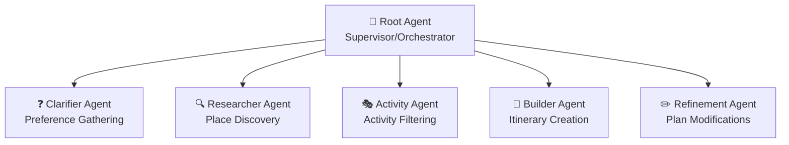

# Travel Agent - Complete Technical Guide

A comprehensive technical documentation covering architecture, implementation details, and system design of the multi-agent travel planning system.

---

## Table of Contents

1. [System Overview](#system-overview)
2. [Architecture Diagram](#architecture-diagram)
3. [Multi-Agent System](#multi-agent-system)
4. [Tool Layer](#tool-layer)
5. [API Design](#api-design)
6. [Server-Driven UI (SDUI)](#server-driven-ui-sdui)
7. [State Management](#state-management)
8. [Data Flow](#data-flow)
9. [Security](#security)
10. [Deployment](#deployment)
11. [Error Handling](#error-handling)
12. [Known Limitations](#known-limitations)

---

## System Overview

The Travel Agent is an AI-powered conversational travel planning assistant built using **Google ADK (Agent Development Kit)**. It uses a hierarchical multi-agent architecture where specialized agents collaborate to understand user preferences, research destinations, and create detailed day-by-day itineraries.

### Key Technologies

| Category                    | Technology                                  |
| --------------------------- | ------------------------------------------- |
| **Backend Framework**       | FastAPI (Python 3.12)                       |
| **AI Framework**            | Google ADK                                  |
| **LLM Model**               | Gemini 2.5 Flash                            |
| **External APIs**           | Google Places, Google Routes, Google Search |
| **Authentication**          | Firebase JWT                                |
| **State Storage**           | Redis (with in-memory fallback)             |
| **Real-time Communication** | Server-Sent Events (SSE)                    |
| **Deployment**              | Docker, Google Cloud Run                    |

### Project Structure

```
travel_agent/
├── api.py                  # FastAPI endpoints, SSE streaming, rate limiting
├── schemas.py              # Pydantic models for SDUI components
├── workflow_schemas.py     # Task/workflow status schemas
├── config.py               # Environment configuration
├── context.py              # Session context (contextvars)
├── firebase_auth.py        # Firebase JWT verification
├── redis_state.py          # Redis state service with fallback
├── runner.py               # ADK runner configuration
├── logging.py              # Structured logging setup
│
├── agents/
│   ├── root_agent.py       # Supervisor (orchestrator)
│   ├── clarifier.py        # Preference gathering
│   ├── researcher.py       # Place discovery
│   ├── activity_agent.py   # Activity filtering
│   ├── builder.py          # Itinerary construction
│   └── refinement_agent.py # Plan modifications
│
└── tools/
    ├── __init__.py         # Tool exports + grouped lists
    ├── datetime_tools.py   # Date/time utilities
    ├── search_tools.py     # Google Search integration
    ├── places_tools.py     # Google Places API
    ├── maps_tools.py       # Google Routes API
    ├── state_tools.py      # State management
    ├── extraction_tools.py # Entity extraction
    ├── validation_tools.py # Input validation
    ├── scheduler_tools.py  # Scheduling utilities
    └── ui_tools.py         # SDUI rendering
```

---

## Architecture Diagram

```
                           ┌─────────────────────────────────────────────────┐
                           │                  FRONTEND                       │
                           │            (React Chat Interface)               │
                           │                                                 │
                           │   ┌─────────────┐    ┌─────────────────────┐   │
                           │   │  Chat UI    │    │ SDUI Components     │   │
                           │   │  Messages   │    │ (dynamically        │   │
                           │   │  Input      │    │  rendered)          │   │
                           │   └──────┬──────┘    └─────────────────────┘   │
                           └──────────┼─────────────────────────────────────┘
                                      │
                                      │ HTTP/SSE
                                      ▼
    ┌─────────────────────────────────────────────────────────────────────────┐
    │                              FASTAPI BACKEND                             │
    │                                                                          │
    │  ┌─────────────┐  ┌───────────────┐  ┌─────────────┐  ┌──────────────┐  │
    │  │ /chat       │  │ /chat/stream  │  │ /session    │  │ /health      │  │
    │  │ (sync)      │  │ (SSE)         │  │ (CRUD)      │  │ (Cloud Run)  │  │
    │  └─────────────┘  └───────────────┘  └─────────────┘  └──────────────┘  │
    │                          │                                               │
    │  ┌───────────────────────┼───────────────────────────────────────────┐  │
    │  │                MIDDLEWARE LAYER                                    │  │
    │  │   Firebase Auth → Rate Limiter (slowapi) → Request Logger         │  │
    │  └───────────────────────┼───────────────────────────────────────────┘  │
    └──────────────────────────┼───────────────────────────────────────────────┘
                               │
                               ▼
    ┌─────────────────────────────────────────────────────────────────────────┐
    │                           GOOGLE ADK RUNTIME                             │
    │                                                                          │
    │  ┌─────────────────────────────────────────────────────────────────┐    │
    │  │                         ADK RUNNER                               │    │
    │  │   • Manages agent execution                                      │    │
    │  │   • Handles conversation state                                   │    │
    │  │   • Streams events                                               │    │
    │  └───────────────────────────────────┬─────────────────────────────┘    │
    │                                      │                                   │
    │  ┌───────────────────────────────────▼─────────────────────────────┐    │
    │  │                     SESSION SERVICE                              │    │
    │  │   • InMemorySessionService (ADK built-in)                        │    │
    │  │   • Conversation history                                         │    │
    │  └─────────────────────────────────────────────────────────────────┘    │
    └─────────────────────────────────────────────────────────────────────────┘
                               │
                               ▼
    ┌─────────────────────────────────────────────────────────────────────────┐
    │                        MULTI-AGENT SYSTEM                                │
    │                                                                          │
    │                    ┌─────────────────────────┐                           │
    │                    │      ROOT AGENT         │                           │
    │                    │     (Supervisor)        │                           │
    │                    │                         │                           │
    │                    │  • Orchestrates flow    │                           │
    │                    │  • Talks to user        │                           │
    │                    │  • Delegates to agents  │                           │
    │                    └───────────┬─────────────┘                           │
    │                                │                                         │
    │       ┌────────────┬───────────┼───────────┬────────────┐               │
    │       ▼            ▼           ▼           ▼            ▼               │
    │  ┌─────────┐ ┌──────────┐ ┌─────────┐ ┌─────────┐ ┌──────────┐         │
    │  │Clarifier│ │Researcher│ │Activity │ │ Builder │ │Refinement│         │
    │  │  Agent  │ │  Agent   │ │  Agent  │ │  Agent  │ │  Agent   │         │
    │  └─────────┘ └──────────┘ └─────────┘ └─────────┘ └──────────┘         │
    │       │            │           │           │            │               │
    └───────┼────────────┼───────────┼───────────┼────────────┼───────────────┘
            │            │           │           │            │
            ▼            ▼           ▼           ▼            ▼
    ┌─────────────────────────────────────────────────────────────────────────┐
    │                            TOOL LAYER                                    │
    │                                                                          │
    │  ┌─────────┐ ┌─────────┐ ┌─────────┐ ┌─────────┐ ┌─────────┐            │
    │  │DateTime │ │ Places  │ │  Maps   │ │ Search  │ │ State   │            │
    │  │ Tools   │ │ Tools   │ │ Tools   │ │ Tools   │ │ Tools   │            │
    │  └────┬────┘ └────┬────┘ └────┬────┘ └────┬────┘ └────┬────┘            │
    │       │           │           │           │           │                 │
    │  ┌─────────┐ ┌─────────┐ ┌─────────┐                                    │
    │  │Validate │ │  UI     │ │Extract  │                                    │
    │  │ Tools   │ │ Tools   │ │ Tools   │                                    │
    │  └─────────┘ └─────────┘ └─────────┘                                    │
    └─────────────────────────────────────────────────────────────────────────┘
                               │
                               ▼
    ┌─────────────────────────────────────────────────────────────────────────┐
    │                        EXTERNAL SERVICES                                 │
    │                                                                          │
    │  ┌───────────┐  ┌───────────┐  ┌───────────┐  ┌───────────┐             │
    │  │  Google   │  │  Google   │  │  Google   │  │  Firebase │             │
    │  │  Places   │  │  Routes   │  │  Search   │  │   Auth    │             │
    │  │   API     │  │   API     │  │   API     │  │           │             │
    │  └───────────┘  └───────────┘  └───────────┘  └───────────┘             │
    │                                                                          │
    │  ┌───────────────────────────────────────────────────────────┐          │
    │  │                       REDIS                                │          │
    │  │   • Trip state storage                                    │          │
    │  │   • Session ownership                                      │          │
    │  │   • Fallback: In-memory dict                              │          │
    │  └───────────────────────────────────────────────────────────┘          │
    └─────────────────────────────────────────────────────────────────────────┘
```

---

## Multi-Agent System

The system uses a **hierarchical agent architecture** where a root supervisor agent orchestrates specialized sub-agents.

### Agent Hierarchy



### 1. Root Agent (Supervisor)

**File**: `agents/root_agent.py`

| Property | Value                                                  |
| -------- | ------------------------------------------------------ |
| Name     | `supervisor`                                           |
| Model    | `gemini-2.5-flash`                                     |
| Role     | Orchestrates all sub-agents, direct user communication |

**Key Responsibilities**:

- Maintains conversational flow with the user
- Delegates to specialized agents based on context
- Never mentions internal tools, agents, or systems
- Ensures itineraries are complete and realistic

**Sub-agents as Tools**:

```python
clarifier_tool = AgentTool(agent=clarifier_agent)
researcher_tool = AgentTool(agent=researcher_agent)
activity_tool = AgentTool(agent=activity_agent)
builder_tool = AgentTool(agent=builder_agent)
refinement_tool = AgentTool(agent=refinement_agent)
```

---

### 2. Clarifier Agent

**File**: `agents/clarifier.py`

| Property | Value                                                                                           |
| -------- | ----------------------------------------------------------------------------------------------- |
| Name     | `clarifier_agent`                                                                               |
| Model    | `gemini-2.5-flash`                                                                              |
| Tools    | `validate_destination`, `validate_budget`, `get_calendar_dates`, `set_preferences`, `render_ui` |

**Key Responsibilities**:

- Gather trip preferences through structured questions
- Ask **exactly one question per turn** (for proper UI rendering)
- Support two modes: **GUIDED** and **SURPRISE_ME**

**Question Flow** (in order):

1. Destination → `text_input` UI
2. Dates → `date_range_picker` UI
3. Budget → `budget_slider` UI
4. Companions → `companion_selector` UI
5. Interests → `preference_chips` UI
6. Travel Style → `preference_chips` UI
7. Accommodation → `preference_chips` UI
8. Must-haves/Avoids → `text_input` UI

---

### 3. Researcher Agent

**File**: `agents/researcher.py`

| Property | Value                                                                                           |
| -------- | ----------------------------------------------------------------------------------------------- |
| Name     | `researcher_agent`                                                                              |
| Model    | `gemini-2.5-flash`                                                                              |
| Tools    | `find_places_nearby`, `search_travel_info`, `search_transport`, `add_places`, `get_preferences` |

**Key Responsibilities**:

- Find hotels (3-5 options matching budget/style)
- Discover attractions and points of interest
- Locate restaurants matching cuisine preferences
- Save results to state for other agents

---

### 4. Activity Agent

**File**: `agents/activity_agent.py`

| Property | Value                                                                               |
| -------- | ----------------------------------------------------------------------------------- |
| Name     | `activity_agent`                                                                    |
| Model    | `gemini-2.5-flash`                                                                  |
| Tools    | `find_places_nearby`, `get_places`, `get_preferences`, `set_recommended_activities` |

**Key Responsibilities**:

- Filter activities based on user interests
- Kid-friendly recommendations for families
- Romantic options for couples
- Match activity intensity to travel style

---

### 5. Builder Agent

**File**: `agents/builder.py`

| Property | Value                                                                                                          |
| -------- | -------------------------------------------------------------------------------------------------------------- |
| Name     | `itinerary_builder`                                                                                            |
| Model    | `gemini-2.5-flash`                                                                                             |
| Tools    | `compute_route_matrix`, `validate_open_hours`, `add_time_duration`, `get_places`, `set_itinerary`, `render_ui` |

**Key Responsibilities**:

- Create day-by-day itineraries
- Optimize routes (group nearby places)
- Include meals: Breakfast, Lunch, Dinner
- Validate opening hours
- Render `itinerary_card` or `itinerary_timeline` UI

**Itinerary Rules**:

- 3-4 activities per day
- Include rest/buffer time
- No unexplained gaps > 60 minutes
- Meals at appropriate times

---

### 6. Refinement Agent

**File**: `agents/refinement_agent.py`

| Property | Value                                                  |
| -------- | ------------------------------------------------------ |
| Name     | `refinement_agent`                                     |
| Model    | `gemini-2.5-flash`                                     |
| Tools    | `find_places_nearby`, `get_itinerary`, `set_itinerary` |

**Key Responsibilities**:

- Handle mid-plan modifications
- Swap activities (e.g., "swap museum for shopping")
- Add/remove activities
- Adjust schedule timing
- Budget adjustments

---

## Tool Layer

Tools are grouped by functionality and assigned to specific agents based on their needs.

### Tool Categories

#### 1. DateTime Tools (`datetime_tools.py`)

| Tool                   | Purpose                           | Example                              |
| ---------------------- | --------------------------------- | ------------------------------------ |
| `get_current_datetime` | Current date/time in any timezone | Used for relative date references    |
| `get_calendar_dates`   | Parse and validate travel dates   | Auto-adjusts past dates to next year |
| `add_time_duration`    | Calculate end times               | 9:00 AM + 2h = 11:00 AM              |

#### 2. Places Tools (`places_tools.py`)

| Tool                 | Purpose                                 | API               |
| -------------------- | --------------------------------------- | ----------------- |
| `find_places_nearby` | Search hotels, restaurants, attractions | Google Places API |

**Parameters**:

- `location`: City or coordinates
- `type`: hotel, restaurant, tourist_attraction, etc.
- `keyword`: Additional search terms
- `price_level`: 1-4 (budget to luxury)

#### 3. Maps Tools (`maps_tools.py`)

| Tool                   | Purpose                        | API               |
| ---------------------- | ------------------------------ | ----------------- |
| `compute_route_matrix` | Travel times between locations | Google Routes API |
| `validate_open_hours`  | Check if place is open         | Google Places API |

#### 4. Search Tools (`search_tools.py`)

| Tool                 | Purpose                    | API           |
| -------------------- | -------------------------- | ------------- |
| `search_travel_info` | General travel information | Google Search |
| `search_transport`   | Flights, trains, buses     | Google Search |

> **Note**: Google Search cannot be used in sub-agents wrapped as `AgentTool` due to ADK limitations. Only the root agent can use it directly.

#### 5. State Tools (`state_tools.py`)

| Tool                         | Purpose                                       |
| ---------------------------- | --------------------------------------------- |
| `set_preferences`            | Save user trip preferences                    |
| `get_preferences`            | Retrieve saved preferences                    |
| `add_places`                 | Add discovered hotels/restaurants/attractions |
| `get_places`                 | Retrieve saved places                         |
| `set_recommended_activities` | Save filtered activities                      |
| `set_itinerary`              | Save generated itinerary                      |
| `get_itinerary`              | Retrieve saved itinerary                      |
| `get_trip_state`             | Get complete state object                     |
| `set_phase`                  | Update workflow phase                         |

#### 6. Validation Tools (`validation_tools.py`)

| Tool                   | Purpose             | Example                      |
| ---------------------- | ------------------- | ---------------------------- |
| `validate_destination` | Normalize locations | "Tokio" → "Tokyo, Japan"     |
| `validate_budget`      | Parse budget inputs | "$5k", "mid-range", "luxury" |

#### 7. UI Tools (`ui_tools.py`)

| Tool                    | Purpose                       |
| ----------------------- | ----------------------------- |
| `render_ui`             | Trigger SDUI component        |
| `render_itinerary_card` | Specialized itinerary display |
| `set_chat_title`        | Set conversation title        |

#### 8. Extraction Tools (`extraction_tools.py`)

| Tool                    | Purpose                          |
| ----------------------- | -------------------------------- |
| `extract_trip_entities` | Extract entities from user input |
| `get_next_question`     | Determine next question to ask   |

### Tool Groups by Agent

```python
RESEARCH_TOOLS = [
    find_places_nearby,
    get_current_datetime,
    search_transport,
    search_travel_info,
    add_places,
    get_preferences,
]

BUILDER_TOOLS = [
    compute_route_matrix,
    validate_open_hours,
    add_time_duration,
    get_places,
    get_preferences,
    set_itinerary,
    render_ui,
]

CLARIFIER_TOOLS = [
    validate_destination,
    validate_budget,
    get_calendar_dates,
    set_preferences,
    get_preferences,
    extract_trip_entities,
    get_next_question,
    render_ui,
]

ACTIVITY_TOOLS = [
    find_places_nearby,
    get_places,
    get_preferences,
    set_recommended_activities,
]
```

---

## API Design

### Endpoints

| Endpoint        | Method | Auth | Rate Limit | Description                      |
| --------------- | ------ | ---- | ---------- | -------------------------------- |
| `/health`       | GET    | ❌   | ❌         | Cloud Run health check           |
| `/ui-schema`    | GET    | ❌   | ❌         | List available UI components     |
| `/session`      | POST   | ✅   | ❌         | Create new chat session          |
| `/session/{id}` | GET    | ✅   | ❌         | Get session history and state    |
| `/session/{id}` | DELETE | ✅   | ❌         | Delete session                   |
| `/chat`         | POST   | ✅   | ❌         | Synchronous chat (full response) |
| `/chat/stream`  | POST   | ✅   | 30/min     | **SSE streaming (recommended)**  |

### Request/Response Models

**ChatRequest**:

```json
{
  "message": "Plan a trip to Tokyo",
  "session_id": "uuid-optional"
}
```

**ChatResponse** (sync):

```json
{
  "response": "Where are you traveling from?",
  "session_id": "abc-123",
  "ui": {
    "type": "text_input",
    "props": {
      "placeholder": "e.g., New York, London"
    }
  }
}
```

### SSE Event Types

The `/chat/stream` endpoint emits these event types:

```typescript
type SSEEvent =
  | { type: "plan"; tasks: Task[] } // Initial task plan
  | { type: "task_start"; taskId: string } // Agent started
  | { type: "task_complete"; taskId: string } // Agent finished
  | { type: "thinking"; message: string } // Current action
  | { type: "token"; text: string } // Partial text chunk
  | { type: "done"; session_id: string; ui?: UIComponent }
  | { type: "error"; message: string };
```

**Example SSE Stream**:

```
data: {"type": "thinking", "message": "Understanding your request..."}

data: {"type": "task_start", "taskId": "clarifier"}

data: {"type": "token", "text": "Great choice! "}

data: {"type": "token", "text": "Tokyo is amazing. "}

data: {"type": "task_complete", "taskId": "clarifier"}

data: {"type": "done", "session_id": "abc-123", "ui": {"type": "date_range_picker", "props": {}}}
```

---

## Server-Driven UI (SDUI)

The backend controls which UI components to display via `render_ui` tool calls. The frontend dynamically renders components based on the response.

### Available Components

| Component            | Purpose                   | Key Props                                   |
| -------------------- | ------------------------- | ------------------------------------------- |
| `budget_slider`      | Budget selection          | `min`, `max`, `presets`, `currency`         |
| `date_range_picker`  | Date selection            | `min_date`, `max_date`, `show_presets`      |
| `preference_chips`   | Interest/option selection | `options`, `multi_select`, `min_selections` |
| `companion_selector` | Travel companion type     | `options`, `show_kids_age_input`            |
| `text_input`         | Free-form text            | `placeholder`                               |
| `itinerary_card`     | Single day itinerary      | `day_number`, `date`, `theme`, `activities` |
| `itinerary_timeline` | Visual timeline           | `segments`, `total_duration`                |
| `place_card`         | Single place info         | `name`, `rating`, `image_url`               |
| `quick_actions`      | Action buttons            | `actions[]`                                 |
| `rating_feedback`    | Trip rating               | `scale`, `show_comment`                     |
| `confirmation`       | Confirm dialog            | `title`, `message`                          |

### Activity Item Schema

```json
{
  "time": "9:00 AM",
  "title": "Visit Senso-ji Temple",
  "description": "Tokyo's oldest Buddhist temple",
  "duration": "2 hours",
  "type": "attraction",
  "notes": "Arrive early to avoid crowds",
  "image_url": "https://..."
}
```

### Itinerary Card Schema

```json
{
  "type": "itinerary_card",
  "props": {
    "day_number": 1,
    "date": "Mon, Jan 15",
    "theme": "Cultural Exploration",
    "activities": [
      {
        "time": "9:00 AM",
        "title": "Senso-ji Temple",
        "description": "Historic Buddhist temple",
        "duration": "2 hours",
        "type": "attraction"
      },
      {
        "time": "11:30 AM",
        "title": "Lunch at Ramen Street",
        "description": "Underground ramen alley in Tokyo Station",
        "duration": "1 hour",
        "type": "meal"
      }
    ]
  }
}
```

---

## State Management

### State Structure

```json
{
  "preferences": {
    "destination": "Tokyo, Japan",
    "dates": {"start": "2026-01-15", "end": "2026-01-18"},
    "budget": {"min": 100000, "max": 200000, "currency": "INR"},
    "companions": "couple",
    "interests": ["food", "culture", "shopping"],
    "style": "balanced",
    "accommodation": "boutique"
  },
  "hotels": [
    {"name": "...", "rating": 4.5, "price": "$$", ...}
  ],
  "restaurants": [...],
  "attractions": [...],
  "recommended_activities": [...],
  "itinerary": [
    {"day_number": 1, "activities": [...]}
  ],
  "phase": "complete",
  "warnings": []
}
```

### Phases

| Phase         | Description                    |
| ------------- | ------------------------------ |
| `clarifying`  | Gathering user preferences     |
| `researching` | Finding places and attractions |
| `building`    | Creating itinerary             |
| `complete`    | Itinerary delivered            |
| `refining`    | User requested modifications   |

### Redis Keys

```
travel_agent:state:{session_id}   → JSON state object
travel_agent:owner:{session_id}   → User ID (for access control)
```

### Fallback Behavior

If Redis is unavailable:

1. System falls back to in-memory `dict` storage
2. State persists only during server lifetime
3. Warning logged: "Redis: Connection failed, using fallback"

---

## Data Flow

### Complete Trip Planning Flow

```
┌─────────────────────────────────────────────────────────────────────────────┐
│                           USER INTERACTION FLOW                              │
└─────────────────────────────────────────────────────────────────────────────┘

User: "Plan a trip to Tokyo"
         │
         ▼
    ┌─────────────────────────────────────────────────────────────────────┐
    │  PHASE 1: CLARIFICATION                                             │
    │                                                                     │
    │  Root Agent → Clarifier Agent                                       │
    │       │                                                             │
    │       ├─→ validate_destination("Tokyo") → "Tokyo, Japan"            │
    │       │                                                             │
    │       └─→ render_ui("date_range_picker")                            │
    │                                                                     │
    │  Response: "Tokyo is amazing! When are you planning to go?"         │
    │  UI: Date Range Picker                                              │
    └─────────────────────────────────────────────────────────────────────┘
         │
User: "January 15-18"
         │
         ▼
    ┌─────────────────────────────────────────────────────────────────────┐
    │  Clarifier continues... (one question at a time)                    │
    │                                                                     │
    │  • Budget? → render_ui("budget_slider")                             │
    │  • Companions? → render_ui("companion_selector")                    │
    │  • Interests? → render_ui("preference_chips")                       │
    │  • Style? → render_ui("preference_chips")                           │
    │                                                                     │
    │  set_preferences({...}) → Redis                                     │
    └─────────────────────────────────────────────────────────────────────┘
         │
         ▼
    ┌─────────────────────────────────────────────────────────────────────┐
    │  PHASE 2: RESEARCH                                                  │
    │                                                                     │
    │  Root Agent → Researcher Agent                                      │
    │       │                                                             │
    │       ├─→ find_places_nearby("Tokyo", type="lodging") → Hotels      │
    │       ├─→ find_places_nearby("Tokyo", type="attraction") → Sites    │
    │       ├─→ find_places_nearby("Tokyo", type="restaurant") → Food     │
    │       │                                                             │
    │       └─→ add_places({hotels: [...], restaurants: [...], ...})      │
    └─────────────────────────────────────────────────────────────────────┘
         │
         ▼
    ┌─────────────────────────────────────────────────────────────────────┐
    │  PHASE 3: ACTIVITY FILTERING                                        │
    │                                                                     │
    │  Root Agent → Activity Agent                                        │
    │       │                                                             │
    │       ├─→ get_preferences() → {interests: ["food", "culture"]}      │
    │       ├─→ get_places() → [all discovered places]                    │
    │       │                                                             │
    │       └─→ set_recommended_activities([filtered by interests])       │
    └─────────────────────────────────────────────────────────────────────┘
         │
         ▼
    ┌─────────────────────────────────────────────────────────────────────┐
    │  PHASE 4: ITINERARY BUILDING                                        │
    │                                                                     │
    │  Root Agent → Builder Agent                                         │
    │       │                                                             │
    │       ├─→ get_places() → All places                                 │
    │       ├─→ compute_route_matrix([places]) → Travel times             │
    │       ├─→ validate_open_hours(places, times) → Verify timing        │
    │       │                                                             │
    │       ├─→ set_itinerary([{day_number: 1, activities: [...]}])       │
    │       │                                                             │
    │       └─→ render_ui("itinerary_card", {days: [...]})                │
    │                                                                     │
    │  Response: "Here's your Tokyo adventure!"                           │
    │  UI: Itinerary Card (interactive, swappable)                        │
    └─────────────────────────────────────────────────────────────────────┘
         │
User: "Can you swap the museum for shopping?"
         │
         ▼
    ┌─────────────────────────────────────────────────────────────────────┐
    │  PHASE 5: REFINEMENT                                                │
    │                                                                     │
    │  Root Agent → Refinement Agent                                      │
    │       │                                                             │
    │       ├─→ get_itinerary() → Current plan                            │
    │       ├─→ find_places_nearby("Tokyo", type="shopping") → Options    │
    │       │                                                             │
    │       └─→ set_itinerary([updated plan])                             │
    │       └─→ render_ui("itinerary_card", {updated})                    │
    │                                                                     │
    │  Response: "Done! Swapped museum for Shibuya shopping district."    │
    └─────────────────────────────────────────────────────────────────────┘
```

---

## Security

### Authentication

**Firebase JWT Verification** (`firebase_auth.py`):

```python
def get_current_user(authorization: str = Header(None)) -> dict:
    # Extract Bearer token
    # Verify with Firebase Admin SDK
    # Return {uid, email, ...}
```

### Session Ownership

Before accessing any session, the API verifies ownership:

```python
owner = state_service.get_owner(session_id)
if owner != user["uid"]:
    raise HTTPException(403, "Not your session")
```

### Rate Limiting

**slowapi** configuration:

- `/chat/stream`: 30 requests/minute per IP
- Other endpoints: No explicit limit

### CORS

Configured via `config.py`:

```python
ALLOWED_ORIGINS = [
    "http://localhost:5173",
    "https://your-production-domain.com"
]
```

### API Key (Optional)

Optional `X-API-Key` header validation for service-to-service calls:

```python
def verify_api_key(x_api_key: str = Header(None)):
    if settings.api_key and x_api_key != settings.api_key:
        raise HTTPException(401, "Invalid API key")
```

---

## Deployment

### Docker Configuration

**Dockerfile**:

```dockerfile
FROM python:3.12-slim

WORKDIR /app

# Install dependencies
COPY requirements.txt .
RUN pip install --no-cache-dir -r requirements.txt

# Copy application
COPY . .

# Run with uvicorn
CMD ["python", "-m", "uvicorn", "travel_agent.api:app", \
     "--host", "0.0.0.0", "--port", "8080", "--workers", "2"]
```

**docker-compose.yml**:

```yaml
version: "3.8"
services:
  api:
    build: .
    ports:
      - "8080:8080"
    environment:
      - GOOGLE_API_KEY=${GOOGLE_API_KEY}
      - GOOGLE_MAPS_API_KEY=${GOOGLE_MAPS_API_KEY}
      - REDIS_URL=redis://redis:6379
    depends_on:
      - redis

  redis:
    image: redis:alpine
    ports:
      - "6379:6379"
```

### Environment Variables

| Variable                       | Required | Description                           |
| ------------------------------ | -------- | ------------------------------------- |
| `GOOGLE_API_KEY`               | ✅       | Gemini API key                        |
| `GOOGLE_MAPS_API_KEY`          | ✅       | Google Places/Routes API key          |
| `REDIS_URL`                    | ❌       | Redis connection string               |
| `FIREBASE_SERVICE_ACCOUNT_KEY` | ❌       | Path to Firebase service account JSON |
| `ALLOWED_ORIGINS`              | ❌       | CORS origins (comma-separated)        |
| `ENVIRONMENT`                  | ❌       | `development` or `production`         |
| `API_KEY`                      | ❌       | Optional API key for X-API-Key header |

### Cloud Run Deployment

```bash
# Build and push
gcloud builds submit --tag gcr.io/PROJECT_ID/travel-agent

# Deploy
gcloud run deploy travel-agent \
  --image gcr.io/PROJECT_ID/travel-agent \
  --platform managed \
  --region us-central1 \
  --allow-unauthenticated \
  --set-secrets=GOOGLE_API_KEY=google-api-key:latest
```

---

## Error Handling

### Monkey Patch for ADK Stability

The API includes a runtime patch for ADK library issues:

```python
# Handles:
# 1. Empty agent responses (NoneType errors)
# 2. Gemini 503 "model overloaded" with retry

async def patched_run_async(self, *args, **kwargs):
    max_retries = 3
    for attempt in range(max_retries):
        try:
            result = await original_run_async(self, *args, **kwargs)
            if result is None:
                return "I'm thinking about that..."
            return result
        except genai_errors.ServerError as e:
            if "503" in str(e) and attempt < max_retries - 1:
                await asyncio.sleep(2 ** attempt)
                continue
            raise
```

### Error Response Format

```json
{
  "detail": "Error message",
  "error_code": "OPTIONAL_CODE"
}
```

### Common Errors

| HTTP Code | Cause                      | Resolution                 |
| --------- | -------------------------- | -------------------------- |
| 401       | Missing/invalid auth token | Include valid Firebase JWT |
| 403       | Session ownership mismatch | Use your own session_id    |
| 429       | Rate limit exceeded        | Wait and retry             |
| 500       | Agent processing error     | Check logs, retry          |
| 503       | Gemini model overloaded    | Auto-retried, or wait      |

---

## Known Limitations

1. **ADK Empty Response Bug**: Occasionally agents return `None`, causing `TypeError`. Mitigated via monkey patch.

2. **Model Reliability**: `gemini-2.5-flash` sometimes returns tool-only responses without text. System handles gracefully.

3. **Session TTL**: Redis keys have 7-day TTL. Long-term sessions may expire.

4. **Firebase Required in Production**: Authentication cannot be disabled in production without code changes.

5. **Google Search in Sub-agents**: `google_search` tool cannot be used in agents wrapped as `AgentTool` due to ADK limitations.

6. **Concurrent Session Edits**: No locking mechanism for simultaneous edits to the same session.

7. **Rate Limiting Scope**: Rate limits are per-IP, not per-user. May need adjustment for production.

---

## Quick Reference

### Start Development Server

```bash
cd /home/rahul/dev/tech-sprint-25
source .venv/bin/activate
uvicorn travel_agent.api:app --reload
```

### API Base URL

- Local: `http://localhost:8000`
- Production: `https://your-cloud-run-url.run.app`

### Key Files to Modify

| Task                   | File(s)                            |
| ---------------------- | ---------------------------------- |
| Add new UI component   | `schemas.py`, `ui_tools.py`        |
| Modify agent behavior  | `agents/*.py`                      |
| Add new tool           | `tools/*.py`, `tools/__init__.py`  |
| Change API endpoints   | `api.py`                           |
| Update state structure | `redis_state.py`, `state_tools.py` |

---

_Last updated: January 2026_
