# Travel Agent - Complete Technical Documentation

A comprehensive technical overview of the multi-agent travel planning system built with Google ADK (Agent Development Kit).

---

## System Architecture


---

## Agent Hierarchy & Responsibilities

```mermaid
flowchart TD
    ROOT["🎯 Root Agent (Supervisor)
    ━━━━━━━━━━━━━━━━━━━━━━━━━━
    • Orchestrates all sub-agents
    • Maintains conversation flow
    • Delegates to specialists
    • Never mentions 'tools' or 'agents'"]

    CLARIFIER["❓ Clarifier Agent
    ━━━━━━━━━━━━━━━━━━━━━━━━━━
    • Gathers trip preferences
    • Asks ONE question at a time
    • Triggers UI components
    • Modes: GUIDED / SURPRISE_ME"]

    RESEARCHER["🔍 Researcher Agent
    ━━━━━━━━━━━━━━━━━━━━━━━━━━
    • Finds hotels (3-5)
    • Discovers attractions
    • Locates restaurants
    • Uses Google Places API"]

    ACTIVITY["🎭 Activity Agent
    ━━━━━━━━━━━━━━━━━━━━━━━━━━
    • Filters by interests
    • Kid-friendly for families
    • Romantic for couples
    • Saves to state"]

    BUILDER["📅 Builder Agent
    ━━━━━━━━━━━━━━━━━━━━━━━━━━
    • Creates day-by-day plan
    • Optimizes routes
    • Adds meal breaks
    • Triggers itinerary UI"]

    REFINE["✏️ Refinement Agent
    ━━━━━━━━━━━━━━━━━━━━━━━━━━
    • Handles mid-plan changes
    • Swap / Add / Remove
    • Budget adjustments
    • Style modifications"]

    ROOT --> CLARIFIER
    ROOT --> RESEARCHER
    ROOT --> ACTIVITY
    ROOT --> BUILDER
    ROOT --> REFINE
```



---

## Use Case Diagram


---

## Data Flow Sequence


---

## File Structure

```
travel_agent/
├── api.py                 # FastAPI endpoints, SSE streaming, rate limiting
├── schemas.py             # Pydantic models for UI components (12 types)
├── workflow_schemas.py    # Task/workflow status schemas
├── config.py              # Environment settings (Settings class)
├── context.py             # Session context (contextvars)
├── firebase_auth.py       # Firebase JWT verification
├── redis_state.py         # Redis state service with fallback
├── runner.py              # ADK runner configuration
│
├── agents/
│   ├── __init__.py        # Agent exports
│   ├── root_agent.py      # Supervisor (entry point)
│   ├── clarifier.py       # Preference gathering
│   ├── researcher.py      # Place discovery
│   ├── activity_agent.py  # Activity filtering
│   ├── builder.py         # Itinerary construction
│   └── refinement_agent.py# Plan modifications
│
└── tools/
    ├── __init__.py        # Tool exports + grouped lists
    ├── datetime_tools.py  # get_calendar_dates, add_time_duration
    ├── search_tools.py    # search_travel_info, search_transport
    ├── places_tools.py    # find_places_nearby (Google Places)
    ├── maps_tools.py      # compute_route_matrix, validate_open_hours
    ├── state_tools.py     # Redis-backed state management
    ├── extraction_tools.py# Entity extraction for slot-filling
    ├── validation_tools.py# validate_destination, validate_budget
    └── ui_tools.py        # render_ui, set_chat_title
```

---

## API Endpoints

| Endpoint        | Method | Auth | Description                       |
| --------------- | ------ | ---- | --------------------------------- |
| `/health`       | GET    | ❌   | Health check for Cloud Run        |
| `/ui-schema`    | GET    | ❌   | List available UI components      |
| `/session`      | POST   | ✅   | Create new chat session           |
| `/session/{id}` | GET    | ✅   | Get session history + state       |
| `/session/{id}` | DELETE | ✅   | Clear session                     |
| `/chat`         | POST   | ✅   | Sync chat (returns full response) |
| `/chat/stream`  | POST   | ✅   | **SSE streaming** (recommended)   |

### SSE Event Types

```typescript
type SSEEvent =
  | { type: "plan"; tasks: Task[] } // Initial task plan
  | { type: "task_start"; taskId: string } // Agent started
  | { type: "task_complete"; taskId: string } // Agent finished
  | { type: "thinking"; message: string } // Current action
  | { type: "token"; text: string } // Partial response
  | { type: "done"; session_id: string; ui?: UIComponent }
  | { type: "error"; message: string };
```

---

## UI Components (Server-Driven UI)

| Component            | Purpose            | Props                  |
| -------------------- | ------------------ | ---------------------- |
| `budget_slider`      | Budget selection   | min, max, presets      |
| `date_range_picker`  | Date selection     | min_date, show_presets |
| `preference_chips`   | Interest selection | options, multi_select  |
| `companion_selector` | Who's traveling    | options, show_kids_age |
| `text_input`         | Free-form input    | placeholder            |
| `itinerary_card`     | Day-by-day plan    | days[] with activities |
| `itinerary_timeline` | Visual timeline    | segments[]             |
| `place_card`         | Single place info  | name, rating, image    |
| `quick_actions`      | Action buttons     | actions[]              |
| `rating_feedback`    | Trip rating        | scale, show_comment    |

---

## State Management


### Session Scoping

- Each user has unique sessions via Firebase UID
- Session IDs are UUIDs (generated if not provided)
- State is scoped via `contextvars.ContextVar`
- Redis keys: `trip_state:{session_id}`, `session_owner:{session_id}`

---

## Security Features

| Feature               | Implementation                                |
| --------------------- | --------------------------------------------- |
| **Authentication**    | Firebase JWT verification                     |
| **Session Ownership** | Check `redis_state.get_owner()` before access |
| **Rate Limiting**     | slowapi: 30 req/min per IP on `/chat/stream`  |
| **CORS**              | Configurable origins in `config.py`           |
| **API Key**           | Optional `X-API-Key` header validation        |

---

## Production Deployment

```dockerfile
# Multi-stage build
FROM python:3.12-slim AS builder
RUN pip install --user -r requirements.txt

FROM python:3.12-slim
COPY --from=builder /root/.local /root/.local
CMD ["python", "-m", "uvicorn", "travel_agent.api:app",
     "--host", "0.0.0.0", "--port", "8080", "--workers", "2"]
```

### Environment Variables

```bash
# Required
GOOGLE_API_KEY=...              # Gemini + Maps APIs
GOOGLE_MAPS_API_KEY=...         # Places/Routes APIs

# Optional
REDIS_URL=redis://localhost:6379
FIREBASE_SERVICE_ACCOUNT_KEY=/path/to/key.json
ALLOWED_ORIGINS=http://localhost:5173
ENVIRONMENT=development|production
```

---

## Key Design Decisions

1. **Multi-Agent Architecture**: Specialized agents for each task phase
2. **Server-Driven UI**: Backend controls which UI to show, frontend just renders
3. **SSE Streaming**: Real-time updates with task transparency
4. **Redis + Fallback**: Persistent state with graceful degradation
5. **Monkey Patching**: Runtime fix for ADK library bugs
6. **One Question Rule**: All agents ask exactly one question per turn for proper UI flow

---

## Known Limitations

1. **ADK Library Bug**: Empty agent responses cause `TypeError: 'NoneType' object is not iterable` (mitigated via monkey patch)
2. **Model Reliability**: `gemini-2.5-flash` sometimes returns tool-only responses without text
3. **Session Cleanup**: No TTL on Redis keys (potential memory growth)
4. **Firebase Required**: Auth is not optional in production

---

## Technologies Used

| Category         | Technology                         |
| ---------------- | ---------------------------------- |
| **Backend**      | FastAPI, Python 3.12               |
| **AI Framework** | Google ADK (Agent Development Kit) |
| **LLM**          | Gemini 2.5 Flash                   |
| **APIs**         | Google Places, Routes, Search      |
| **Auth**         | Firebase Authentication            |
| **State**        | Redis (with in-memory fallback)    |
| **Streaming**    | Server-Sent Events (SSE)           |
| **Deployment**   | Cloud Run, Docker                  |
